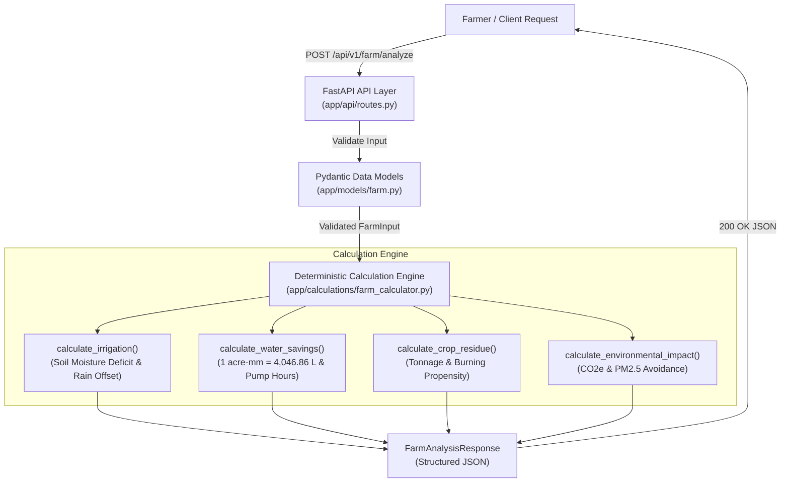
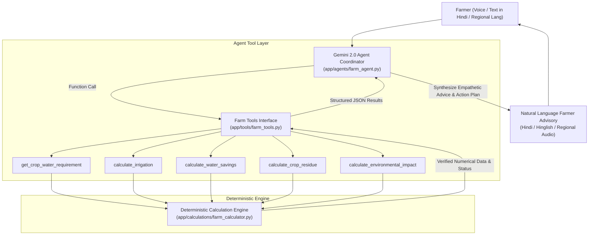

# FarmGuard AI — System Architecture 🌾

> NextStep Hacks 2026 | Theme: **Earth Forward**  
> India-specific AI-powered Sustainable Farming Assistant

---

## 🏛️ Core Architectural Principle: Strict Separation of Math and LLM

A fundamental design requirement of FarmGuard AI is that **Large Language Models (Gemini) must NEVER perform mathematical calculations or unit conversions directly**. 

Instead:
- **Agronomic formulas, hydrological conversions, and emissions modeling** are 100% deterministic Python code.
- **Agent Tools** expose clean, typed interfaces to the deterministic engine.
- **Gemini Agent** orchestrates tool calls, inspects the verified numbers, and provides empathetic, multilingual farmer advisory (Hindi/Hinglish/English).

---

## 🔄 Phase 1 & 2 Current Architecture (FastAPI & Deterministic Engine)

---

## 🤖 Phase 2 & Future Architecture (Agent Tool Calling with Gemini)

---

## 🛠️ Tool Registry Specification (`app/tools/farm_tools.py`)

| Tool Name | Purpose | Key Inputs | Key Output Attributes |
| :--- | :--- | :--- | :--- |
| `get_crop_water_requirement` | Fetch baseline irrigation depth & moisture thresholds | `crop`, `soil_type` | `base_irrigation_depth_mm`, `target_moisture_percent`, `soil_retention_factor` |
| `calculate_irrigation` | Compute net irrigation depth & operational urgency | `crop`, `area_acres`, `soil_moisture_percent`, `rainfall_probability` | `recommended_irrigation_mm`, `status`, `urgency`, `expected_rain_offset_mm` |
| `calculate_water_savings` | Calculate volume of water and tubewell pump hours saved | `crop`, `area_acres`, `current_irrigation_mm`, `recommended_irrigation_mm` | `current_water_liters`, `recommended_water_liters`, `water_savings_liters`, `diesel_or_electricity_savings_hours` |
| `calculate_crop_residue` | Estimate stubble biomass & sustainable in-situ practices | `crop`, `area_acres` | `estimated_residue_tonnes`, `stubble_burning_risk`, `recommended_practices`, `economic_potential_inr` |
| `calculate_environmental_impact` | Calculate avoided greenhouse gas & PM2.5 emissions | `crop`, `area_acres`, `current_irrigation_mm`, `recommended_irrigation_mm` | `co2e_avoided_kg`, `pm25_avoided_kg`, `water_saved_cubic_meters`, `soil_health_benefit` |
| `analyze_farm_pipeline` | Complete end-to-end farm assessment | `FarmInput` parameters | Composite `FarmAnalysisResponse` |

---

## 📈 Centralized Agronomic Constants

All assumptions are maintained in [`app/calculations/farm_calculator.py`](file:///c:/Users/Ankush/Desktop/FarmGuard-AI/backend/app/calculations/farm_calculator.py):
- **Volumetric Baseline**: $1\text{ acre-mm} = 4,046.8564\text{ Liters}$
- **Tubewell Pump Discharge**: $28,000\text{ Liters/hour}$ (5 HP centrifugal pump)
- **Supported Crops**: Wheat, Rice (Paddy), Maize, Sugarcane
- **Supported Soil Profiles**: Alluvial, Loamy, Sandy Loam, Clayey, Clay Loam, Sandy, Black (Vertisols), Red
- **Stubble Emissions Multiplier**: $\sim 1,460\text{ kg } \text{CO}_2\text{e}$ and $\sim 7.5\text{ kg } \text{PM}_{2.5}$ per tonne of wheat straw combusted
