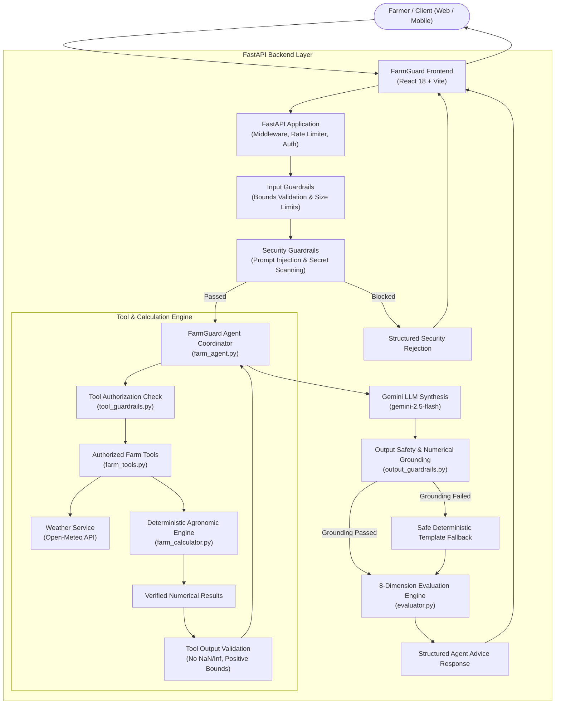
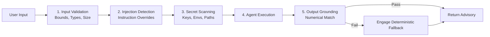

# FarmGuard AI — System Architecture 🌾

> **Technical Architecture & Dataflow Specification**  
> *NextStep Hacks 2026 | Theme: Earth Forward*

---

## 1. High-Level Architecture

FarmGuard AI is architected around a fundamental principle: **Large Language Models (Gemini) must never perform mathematical calculations or unit conversions directly**. 

Instead, all agronomic calculations, volumetric conversions, and emissions modeling are executed deterministically in pure Python. The Gemini agent coordinates tool execution, checks safety guardrails, and synthesizes verified outputs into concise, farmer-friendly explanations.

---

## 2. Frontend Flow (`frontend/src/`)

1. **State Management (`FarmContext.jsx`)**:
   - Manages active field parameters (`crop`, `area_acres`, `soil_type`, `location`, `soil_moisture_percent`, `current_irrigation_mm`, `pump_flow_lpm`).
   - Tracks live backend liveness/readiness via background health probes.
   - Provides demo field profiles with 1-click loading.
2. **Interactive Pages**:
   - **Overview (`OverviewPage.jsx`)**: Value proposition and clear CTA ("Check My Water Need").
   - **Farm Analysis (`FarmAnalysisPage.jsx`)**: 5-step interactive workflow with live Open-Meteo weather fetch, container-fill flow helper, and result hierarchy (Should I water? $\rightarrow$ Water needed in mm $\rightarrow$ Litres for field $\rightarrow$ Pump runtime $\rightarrow$ Environmental impact).
   - **AI Advisor (`AIAdvisorPage.jsx`)**: Conversational interface with session context memory, starter prompts, natural Hinglish support, and collapsible verification traces.
   - **Savings Calculator (`SavingsPage.jsx`)**: Explores tubewell electricity savings, pumping hours avoided, and operational cost reductions.
   - **Technical Pages (`SecurityCenterPage.jsx`, `EvaluationPage.jsx`, `ArchitecturePage.jsx`)**: Auditor-facing pages detailing test benchmarks and system design.

---

## 3. Backend Flow (`backend/app/api/`)

1. **Production Middleware (`backend/app/api/routes.py`, `backend/app/config.py`)**:
   - Constant-time API key verification (when `API_AUTH_ENABLED=true`).
   - In-memory sliding-window rate limiting per client IP (default $60\text{ req/min}$).
   - `X-Request-ID` correlation tracking across all request cycles.
   - Security HTTP response headers (`X-Content-Type-Options`, `X-Frame-Options`, `Content-Security-Policy`).
2. **Endpoints**:
   - `GET /health` & `GET /ready`: Fast, non-blocking liveness and readiness probes.
   - `GET /metrics`: Prometheus-compatible operational telemetry.
   - `POST /api/v1/farm/analyze`: Direct deterministic calculation pipeline.
   - `POST /api/v1/agent/advice`: Full agent advisory lifecycle with guardrails, tool execution, LLM synthesis, and evaluation.

---

## 4. Farm Agent Flow (`backend/app/agents/farm_agent.py`)

1. **Query Classification**:
   - Identifies whether the query is a general concept ("What is FarmGuard?"), symptom inquiry ("My leaves are yellow"), MM unit question ("What does 28.2 mm mean?"), pump runtime query ("How long to run pump?"), Hinglish question ("Bhai aaj paani du kya?"), or out-of-scope inquiry.
2. **Conversational Slot Extraction**:
   - Multilingual regex extraction for crop types (English and Hindi), acreage, soil moisture percentage, location aliases, and pump flow in L/min.
3. **Missing Parameter Resolution**:
   - If required parameters are missing, returns structured `missing_fields` and asks specifically for missing data without hallucinating values.

---

## 5. Guardrail Flow (`backend/app/guardrails/`)

- **Input Guardrails (`input_guardrails.py`)**: Enforces agronomic boundaries (area $> 0$, moisture $0-100\%$, valid crops/soils) and caps message length at 2,000 characters.
- **Security Guardrails (`security.py`)**: Detects prompt injection patterns and scans for API credentials or system secrets.
- **Output Guardrails (`output_guardrails.py`)**: Extracts numbers from the synthesized advisory and verifies them against the tool calculation results. If numbers deviate or if unwarranted certainty is detected, falls back to deterministic template generation.

---

## 6. Tool Authorization Flow (`backend/app/guardrails/tool_guardrails.py`)

All tool executions pass through an explicit authorization gate:
1. **Whitelist Verification**: Only pre-registered tools (`get_weather_forecast`, `get_crop_water_requirement`, `calculate_irrigation`, `calculate_water_savings`, `calculate_crop_residue`, `calculate_environmental_impact`) can execute.
2. **Pre-Execution Input Sanitization**: Rejects `NaN`, `Infinity`, and out-of-bounds parameters.
3. **Post-Execution Output Sanitization**: Verifies that volumes, economic metrics, and residue tonnages are non-negative.

---

## 7. Numerical Calculation Flow (`backend/app/calculations/farm_calculator.py`)

### A. Volumetric Conversion
$$\text{Water Needed (Litres)} = \text{Irrigation Depth (mm)} \times \text{Field Area (Acres)} \times 4,046.8564$$

### B. Flow-Based Pump Running Time
$$\text{Pump Runtime (Minutes)} = \frac{\text{Water Needed (Litres)}}{\text{Pump Flow (L/min)}}$$

### C. Soil Moisture Deficit
$$\text{Moisture Deficit (\%)} = \max(0, \text{Target Moisture (\%)} - \text{Current Soil Moisture (\%)})$$
$$\text{Irrigation Required (mm)} = \max(0, (\text{Base Depth} \times \text{Soil Retention Factor} \times \text{Deficit Ratio}) - \text{Effective Rainfall})$$

### D. Residue & Environmental Impact
$$\text{Residue (Tonnes)} = \text{Field Area (Acres)} \times \text{Crop Residue Factor}$$
$$\text{Avoided }\text{CO}_2\text{e (kg)} = \text{Residue (Tonnes)} \times 1,460\text{ kg CO}_2\text{e/tonne}$$

---

## 8. Chat & Session Context Flow

- **Session Context**: The frontend `AIAdvisorPage` maintains a `sessionFarm` state that accumulates parameters as the conversation progresses.
- **Context Display**: An active context token pill displays retained parameters (e.g. `Crop: RICE • 2.5 Acres • Moisture: 35% • Uttar Pradesh`).
- **Reset Chat**: 1-click action clears the message history and resets session parameters to a clean state.

---

## 9. Failure & Missing-Data Behavior

- **Missing Parameters**: The assistant clearly states what is missing and provides a numbered list of questions.
- **Weather API Failure**: If Open-Meteo is unreachable, the system falls back to historical agro-climatic regional norms without crashing.
- **LLM API Timeout/Failure**: If the Gemini API experiences a network or quota error, the agent falls back to pure deterministic template synthesis with zero downtime.
- **Security Violations**: Prompt injection attempts return a clean, structured refusal without leaking system prompts or internal logic.

---

## 10. Security Boundaries

- **No Secrets in Frontend**: All API keys, Google Gemini credentials, and server tokens remain strictly on the backend.
- **Zero Raw Code Execution**: The LLM operates in text synthesis mode with no arbitrary Python execution privileges.
- **Defense-in-Depth Layering**: Even if an LLM generates invalid data, the output guardrail and deterministic calculation layers guarantee that ungrounded numbers never reach the user.
