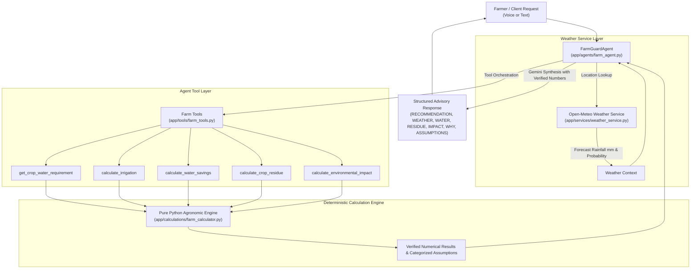

# FarmGuard AI — System Architecture 🌾

> NextStep Hacks 2026 | Theme: **Earth Forward**  
> India-specific AI-powered Sustainable Farming Assistant

---

## 🏛️ Core Architectural Principle: Strict Separation of Math and LLM

A fundamental design requirement of FarmGuard AI is that **Large Language Models (Gemini) must NEVER perform mathematical calculations or unit conversions directly**. 

Instead:
- **Agronomic formulas, hydrological conversions, and emissions modeling** are 100% deterministic Python code.
- **Agent Tools** expose clean, typed interfaces to the deterministic engine and external weather APIs.
- **Gemini Agent** orchestrates tool calls, inspects the verified numbers, and provides empathetic, multilingual farmer advisory (Hindi/Hinglish/English).

---

## 🔄 End-to-End System Architecture

---

## 🌦️ Weather and Uncertainty

### 1. Rainfall Probability vs. Precipitation Depth
- In standard meteorology, **Rainfall Probability** ($0-100\%$) indicates the likelihood of precipitation occurring ($\ge 0.1\text{ mm}$), NOT the quantity of water.
- FarmGuard AI strictly distinguishes between:
  - `rainfall_probability`: Risk and confidence signal (e.g., 70% chance).
  - `forecast_rainfall_mm`: Quantifiable depth in millimeters (e.g., $12.4\text{ mm}$).
- **Hardening Rule**: If only `rainfall_probability` is known, FarmGuard AI **never fabricates a synthetic rainfall depth**. The system advises the farmer to cross-verify local radar before altering scheduled irrigation. When `forecast_rainfall_mm` is available, it is factored directly into the root-zone water balance.

### 2. Live Weather Fallback & Fault Tolerance
- Real-time weather forecasts are fetched via Open-Meteo API for Indian agricultural regions.
- If the weather API encounters timeouts, network outages, or unresolvable coordinates, the service gracefully degrades to `status: "unavailable"` without breaking API availability.

### 3. Decision Support vs. Prescriptions
- Recommendations are designed as **advisory decision support tools**, not legally binding or guaranteed agronomic prescriptions.
- When calculated net irrigation is $0\text{ mm}$, the agent explicitly states:
  > *"The current prototype model recommends postponing irrigation under the provided rainfall and soil-moisture assumptions."*

---

## 🛠️ Tool Registry Specification (`app/tools/farm_tools.py`)

| Tool Name | Purpose | Key Inputs | Key Output Attributes |
| :--- | :--- | :--- | :--- |
| `get_weather_forecast` | Fetch real-time precipitation forecast & probability | `location` | `forecast_rainfall_mm`, `rainfall_probability`, `status`, `source` |
| `get_crop_water_requirement` | Fetch baseline irrigation depth & moisture thresholds | `crop`, `soil_type` | `base_irrigation_depth_mm`, `target_moisture_percent`, `soil_retention_factor` |
| `calculate_irrigation` | Compute net irrigation depth & operational urgency | `crop`, `area_acres`, `soil_moisture_percent`, `forecast_rainfall_mm` | `recommended_irrigation_mm`, `status`, `urgency`, `expected_rain_offset_mm` |
| `calculate_water_savings` | Calculate volume of water and tubewell pump hours saved | `crop`, `area_acres`, `current_irrigation_mm`, `recommended_irrigation_mm` | `current_water_liters`, `recommended_water_liters`, `water_savings_liters`, `diesel_or_electricity_savings_hours` |
| `calculate_crop_residue` | Estimate stubble biomass & sustainable in-situ practices | `crop`, `area_acres` | `estimated_residue_tonnes`, `stubble_burning_risk`, `recommended_practices`, `economic_potential_inr` |
| `calculate_environmental_impact` | Calculate avoided greenhouse gas & PM2.5 emissions | `crop`, `area_acres`, `current_irrigation_mm`, `recommended_irrigation_mm` | `co2e_avoided_kg`, `pm25_avoided_kg`, `water_saved_cubic_meters`, `soil_health_benefit` |
| `analyze_farm_pipeline` | Complete end-to-end farm assessment | `FarmInput` parameters | Composite `FarmAnalysisResponse` |

---

## 📈 Centralized Agronomic Constants & Prototype Assumptions

All assumptions are maintained in [`app/calculations/farm_calculator.py`](file:///c:/Users/Ankush/Desktop/FarmGuard-AI/backend/app/calculations/farm_calculator.py):
- **Volumetric Baseline**: $1\text{ acre-mm} = 4,046.8564\text{ Liters}$ (exact physical geometry).
- **Tubewell Pump Discharge**: $28,000\text{ Liters/hour}$ (standard 5 HP centrifugal pump prototype assumption).
- **Supported Crops**: Wheat, Rice (Paddy), Maize, Sugarcane (prototype single-cycle depth models).
- **Supported Soil Profiles**: Alluvial, Loamy, Sandy Loam, Clayey, Clay Loam, Sandy, Black (Vertisols), Red.
- **Stubble Emissions Multipliers**: Prototype combustion emissions factors ($\sim 1,460\text{ kg } \text{CO}_2\text{e}$ and $\sim 7.5\text{ kg } \text{PM}_{2.5}$ per tonne wheat straw burned).
