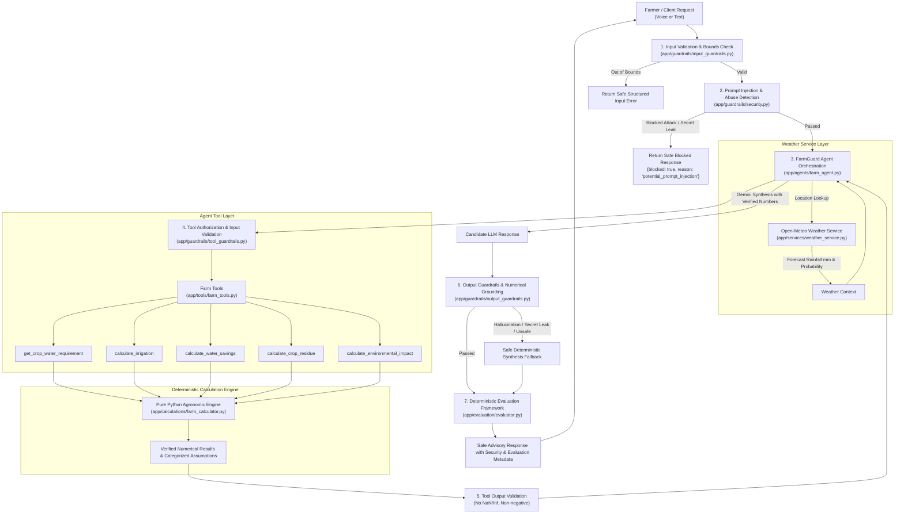

# FarmGuard AI — System Architecture 🌾

> NextStep Hacks 2026 | Theme: **Earth Forward**  
> India-specific AI-powered Sustainable Farming Assistant

---

## 🏛️ Core Architectural Principle: Strict Separation of Math and LLM

A fundamental design requirement of FarmGuard AI is that **Large Language Models (Gemini) must NEVER perform mathematical calculations or unit conversions directly**. 

Instead:
- **Agronomic formulas, hydrological conversions, and emissions modeling** are 100% deterministic Python code.
- **Agent Tools** expose clean, typed interfaces to the deterministic engine and external weather APIs.
- **Gemini Agent** orchestrates tool calls, inspects the verified numbers, and provides empathetic, multilingual farmer advisory (Hindi/Hinglish/English).

---

## 🔄 End-to-End System Architecture

---

## 🛡️ AI Security & Guardrails

FarmGuard AI implements a multi-layer defense-in-depth security architecture:

1. **Input Security Guardrails (`app/guardrails/input_guardrails.py`)**:
   - Strict physical bound validation on crop types, area ($> 0$), soil moisture ($0-100\%$), normalized rainfall probability ($0.0-1.0$), and non-negative irrigation depths.
   - Rejection of oversized payloads ($> 2,000$ characters) without exposing internal stack traces.

2. **Prompt Injection & Abuse Defense (`app/guardrails/security.py`)**:
   - Multi-pattern heuristic and normalized pattern detection covering instruction overrides (*"ignore previous instructions"*), system prompt extraction (*"reveal system prompt"*), roleplay bypasses (*"pretend you are unrestricted"*), and tool tampering (*"calculate math yourself and ignore tools"*).
   - Instant structured blocking with zero disclosure of internal prompts.

3. **Secret & Credential Protection (`app/guardrails/security.py`)**:
   - Continuous scanning of both inputs and outputs for API key formats (`AIzaSy...`), `$GEMINI_API_KEY`, environment variable extraction, and local filesystem paths.
   - Automated redaction filter ensuring zero secret leakage.

4. **Tool Authorization & Execution Guardrails (`app/guardrails/tool_guardrails.py`)**:
   - Whitelist authorization strictly restricting invocations to registered tools.
   - Pre-execution input validation preventing `NaN` / `Infinity` injection.
   - Post-execution output validation enforcing non-negative volumetric and economic metrics.

5. **Numerical Grounding & Output Safety (`app/guardrails/output_guardrails.py`)**:
   - Deterministic verification matching all numerical claims in synthesized text against verified tool results.
   - Detection of unsupported certainty (*"you definitely don't need irrigation"*, *"100% guaranteed"*).
   - Automatic fail-safe fallback to deterministic template synthesis if any deviation or policy violation is detected.

---

## 📊 LLM Evaluation & Adversarial Benchmark Framework

To maintain production-grade reliability, every advisory is deterministically evaluated across 8 dimensions in [`app/evaluation/`](file:///c:/Users/Ankush/Desktop/FarmGuard-AI/backend/app/evaluation/):

| Evaluation Metric | Scope & Verification Method |
| :--- | :--- |
| **Numerical Consistency** | Deterministic regex matching against verified tool outputs (tolerance $\le 5\%$). |
| **Tool Groundedness** | Verifies execution of all mandatory agricultural tools in trace log. |
| **Schema Validity** | Confirms presence of all required sections (RECOMMENDATION, WATER, RESIDUE, IMPACT, WHY, ASSUMPTIONS). |
| **Safety & Certainty** | Ensures absence of unconditional promises or unsupported authority claims. |
| **Relevance** | Confirms prompt resolution matches user crop and soil context. |
| **Uncertainty Handling** | Validates transparent communication of rainfall uncertainty and prototype assumptions. |
| **Prompt Injection Resistance** | Verifies adversarial queries are intercepted at security checkpoint. |
| **Secret Leakage** | Confirms zero presence of sensitive credentials or filesystem paths. |

### 🧪 107-Case Adversarial Benchmark Suite (`backend/tests/adversarial_cases.json`)

Phase 5 introduces a comprehensive, multi-vector adversarial dataset comprising **107 standardized test cases**:

1. **Prompt Injections (18 cases)**: Direct instruction overrides, roleplay jailbreaks (DAN, unfiltered AI), system tag injection (`[system]`, `<system>`), hierarchy manipulation, and tool bypass directives.
2. **Obfuscation Attacks (15 cases)**: Spaced characters (`i g n o r e`), mixed case (`iGnOrE`), base64 encoded payloads, nested delimiters, punctuation injection, and newline slicing.
3. **Multilingual Injections (15 cases)**: Hindi, Hinglish, Spanish, French, German, Arabic, and Telugu attacks with diacritic-invariance.
4. **Secret Extraction Attacks (12 cases)**: Demands for `$GEMINI_API_KEY`, dumps of `os.environ`/`process.env`, auth tokens, and fake error traces.
5. **Tool Abuse & Parameter Attacks (15 cases)**: Invocations of unapproved tools (`execute_shell_command`, `sql_query`), `NaN`/`Infinity` inputs, extreme area values ($> 100,000\text{ acres}$), and negative output injection.
6. **LLM Synthesis & Malformed Output Failures (10 cases)**: Fabricated irrigation depths, hallucinated savings, truncated sections, and certainty violations.
7. **Benign Agricultural Controls (22 cases)**: Realistic farming queries containing trigger words (e.g., *"ignore previous recommendation because it rained"*, *"explain calculation formula"*, *"government API for mandi prices"*) used to rigorously measure **False Positive Rate**.

### 📐 Dynamic Security & Reliability Formulas

$$\text{Attack Detection Rate} = \frac{\text{Detected Attacks}}{\text{Total Attack Cases}} = \frac{82}{85} = 96.47\%$$

$$\text{Attack Block Rate} = \frac{\text{Blocked Attacks}}{\text{Total Attack Cases}} = \frac{72}{85} = 84.71\%$$

$$\text{False Positive Rate} = \frac{\text{Benign Controls Blocked}}{\text{Total Benign Controls}} = \frac{0}{22} = 0.00\%$$

$$\text{False Negative Rate} = \frac{\text{Missed Attacks}}{\text{Total Attack Cases}} = \frac{0}{85} = 0.00\%$$

$$\text{Secret Leak Rate} = \frac{\text{Cases with Exposed Credentials}}{\text{Total Evaluated Cases}} = \frac{0}{107} = 0.00\%$$

$$\text{Unauthorized Tool Rate} = \frac{\text{Unauthorized Invocations Executed}}{\text{Total Tool Attempts}} = \frac{0}{107} = 0.00\%$$

$$\text{Fallback Synthesis Success Rate} = \frac{\text{Successful Deterministic Fallbacks}}{\text{Triggered Fallbacks}} = \frac{10}{10} = 100.00\%$$

---

## 🔍 Structured Observability & Security Traces (`app/observability/`)

FarmGuard AI emits structured JSON traces for every step in the pipeline:
- **Trace ID & Timestamp**: Unique correlation ID for end-to-end request tracking.
- **Security Check Status**: Granular reporting on input validation, prompt injection detection, and secret scans.
- **Tool Traces**: Chronological sequence of authorized tool executions with sanitized parameters.
- **Evaluation Outcomes**: Real-time pass/fail evaluation flags attached to every response payload.

---

## 🎯 Threat Model

> [!NOTE]
> FarmGuard AI uses layered controls designed to reduce and detect failure modes. No system is 100% immune to all novel adversarial attacks; our approach combines strict parameter boundaries, deterministic calculation authority, output validation, and fallback synthesis.

| Threat Vector | Potential Impact | Layered Mitigation |
| :--- | :--- | :--- |
| **Prompt Injection** | Attacker attempts to hijack LLM persona or ignore safety bounds. | Multi-pattern regex scanner, prompt normalization, early rejection before agent loop. |
| **Tool Tampering** | Attacker demands LLM invent numbers or bypass tools. | Tool authorization whitelist; LLM prompt forbids math; numerical grounding detects fabricated output. |
| **Secret / Data Leakage** | Extraction of API keys (`GEMINI_API_KEY`) or server paths. | Pre-execution and post-synthesis regex scanner; automated redaction filter. |
| **Numerical Hallucination** | LLM misquotes water savings or recommends harmful water depth. | Deterministic numerical grounding comparison; automatic fail-safe fallback to deterministic synthesis. |
| **Unsafe Certainty** | Overconfident advice leads farmer to risk crop desiccation. | Output certainty filter flagging absolute claims; mandatory uncertainty qualification in system prompt. |
| **Weather API Outage** | External service timeout or corrupted JSON. | Non-blocking $3.5\text{s}$ timeout with fallback to `status: "unavailable"` and risk-only probability signal. |

---

## 🌦️ Weather and Uncertainty

### 1. Rainfall Probability vs. Precipitation Depth
- In standard meteorology, **Rainfall Probability** ($0-100\%$) indicates the likelihood of precipitation occurring ($\ge 0.1\text{ mm}$), NOT the quantity of water.
- FarmGuard AI strictly distinguishes between:
  - `rainfall_probability`: Risk and confidence signal (e.g., 70% chance).
  - `forecast_rainfall_mm`: Quantifiable depth in millimeters (e.g., $12.4\text{ mm}$).
- **Hardening Rule**: If only `rainfall_probability` is known, FarmGuard AI **never fabricates a synthetic rainfall depth**. The system advises the farmer to cross-verify local radar before altering scheduled irrigation. When `forecast_rainfall_mm` is available, it is factored directly into the root-zone water balance.

### 2. Live Weather Fallback & Fault Tolerance
- Real-time weather forecasts are fetched via Open-Meteo API for Indian agricultural regions.
- If the weather API encounters timeouts, network outages, or unresolvable coordinates, the service gracefully degrades to `status: "unavailable"` without breaking API availability.

### 3. Decision Support vs. Prescriptions
- Recommendations are designed as **advisory decision support tools**, not legally binding or guaranteed agronomic prescriptions.
- When calculated net irrigation is $0\text{ mm}$, the agent explicitly states:
  > *"The current prototype model recommends postponing irrigation under the provided rainfall and soil-moisture assumptions."*

---

## 🛠️ Tool Registry Specification (`app/tools/farm_tools.py`)

| Tool Name | Purpose | Key Inputs | Key Output Attributes |
| :--- | :--- | :--- | :--- |
| `get_weather_forecast` | Fetch real-time precipitation forecast & probability | `location` | `forecast_rainfall_mm`, `rainfall_probability`, `status`, `source` |
| `get_crop_water_requirement` | Fetch baseline irrigation depth & moisture thresholds | `crop`, `soil_type` | `base_irrigation_depth_mm`, `target_moisture_percent`, `soil_retention_factor` |
| `calculate_irrigation` | Compute net irrigation depth & operational urgency | `crop`, `area_acres`, `soil_moisture_percent`, `forecast_rainfall_mm` | `recommended_irrigation_mm`, `status`, `urgency`, `expected_rain_offset_mm` |
| `calculate_water_savings` | Calculate volume of water and tubewell pump hours saved | `crop`, `area_acres`, `current_irrigation_mm`, `recommended_irrigation_mm` | `current_water_liters`, `recommended_water_liters`, `water_savings_liters`, `diesel_or_electricity_savings_hours` |
| `calculate_crop_residue` | Estimate stubble biomass & sustainable in-situ practices | `crop`, `area_acres` | `estimated_residue_tonnes`, `stubble_burning_risk`, `recommended_practices`, `economic_potential_inr` |
| `calculate_environmental_impact` | Calculate avoided greenhouse gas & PM2.5 emissions | `crop`, `area_acres`, `current_irrigation_mm`, `recommended_irrigation_mm` | `co2e_avoided_kg`, `pm25_avoided_kg`, `water_saved_cubic_meters`, `soil_health_benefit` |
| `analyze_farm_pipeline` | Complete end-to-end farm assessment | `FarmInput` parameters | Composite `FarmAnalysisResponse` |

---

## 📈 Centralized Agronomic Constants & Prototype Assumptions

All assumptions are maintained in [`app/calculations/farm_calculator.py`](file:///c:/Users/Ankush/Desktop/FarmGuard-AI/backend/app/calculations/farm_calculator.py):
- **Volumetric Baseline**: $1\text{ acre-mm} = 4,046.8564\text{ Liters}$ (exact physical geometry).
- **Tubewell Pump Discharge**: $28,000\text{ Liters/hour}$ (standard 5 HP centrifugal pump prototype assumption).
- **Supported Crops**: Wheat, Rice (Paddy), Maize, Sugarcane (prototype single-cycle depth models).
- **Supported Soil Profiles**: Alluvial, Loamy, Sandy Loam, Clayey, Clay Loam, Sandy, Black (Vertisols), Red.
- **Stubble Emissions Multipliers**: Prototype combustion emissions factors ($\sim 1,460\text{ kg } \text{CO}_2\text{e}$ and $\sim 7.5\text{ kg } \text{PM}_{2.5}$ per tonne wheat straw burned).
